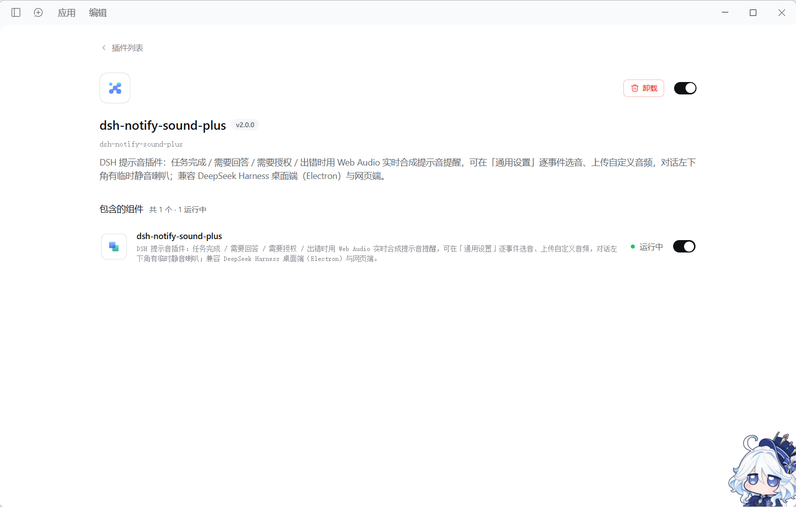
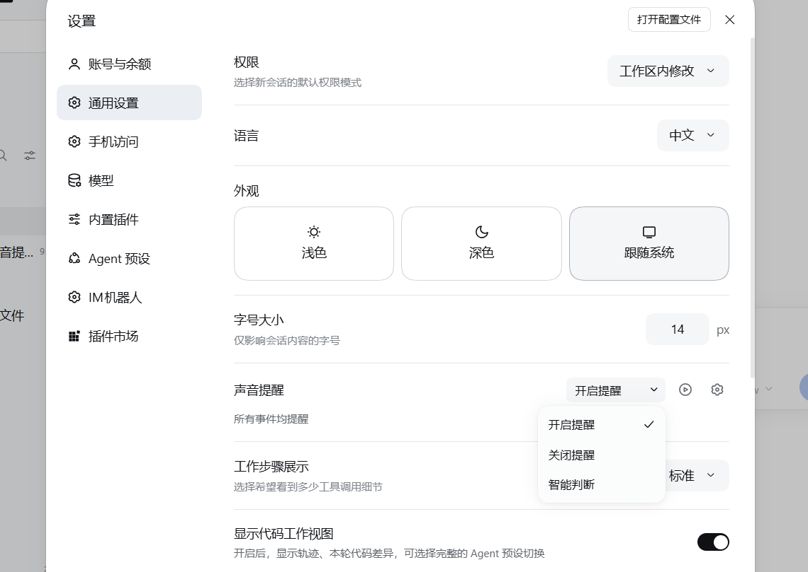
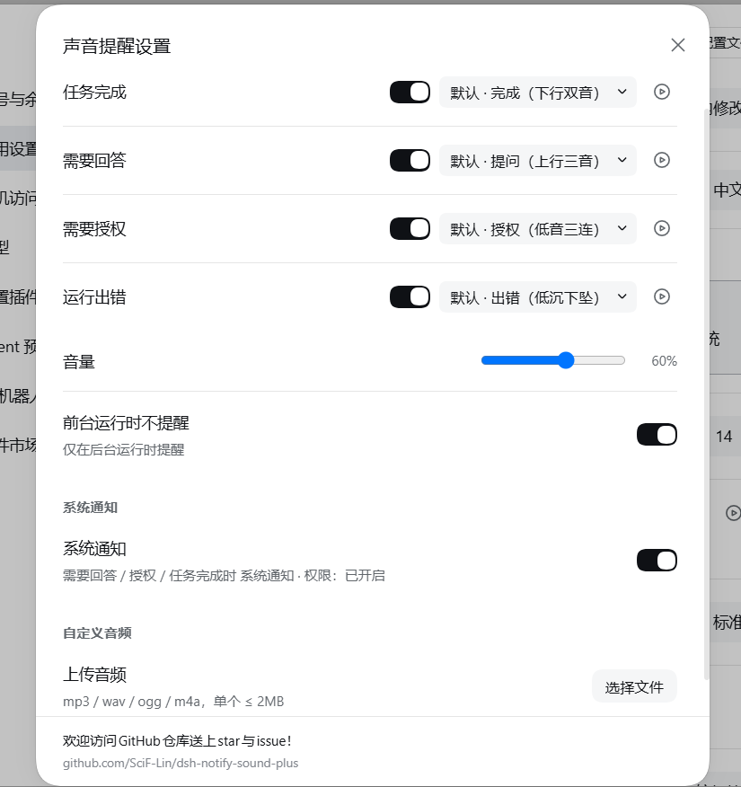
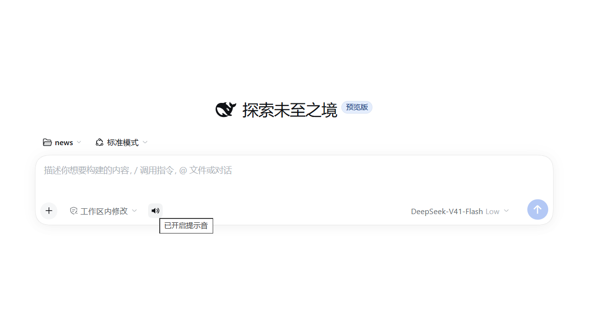

**简体中文** | [English](README.en.md)

# dsh-notify-sound-plus

一款类官方风格的系统通知提示插件，它能给 DeepSeek Harness 加一套**提醒**。
在任务完成 / 需要回答 / 需要授权 / 运行出错时 设置通知与提示音，并可通过**系统通知**在后台提醒。适配网页端与桌面端。



## 插件能做什么

* **系统通知**：需要回答 / 授权 / 任务完成时发送系统通知，可在设置里自行设置
* **在设置里直接选**：哪个事件要提醒、用哪个声音，都能单独调，选完自动试听。
* **换成你自己的声音**：可以上传 mp3 / wav 等音频文件当提示音。
* **智能判断**：如果开启了小鲸鱼挂件提醒将不提示（未开启事件由本插件提醒），避免重复提醒。
* **一键静音**：对话框小喇叭，点一下即可快速静音。
* 默认不吵你：子任务不提醒，自行终止不提醒，刷新页面也不提醒。

## 插件设置

**通用设置** —— 设置入口如图，可以选择模式与详细设置



**详细设置窗口** —— 逐事件开关与选音、音量、前台策略、系统通知、自定义音频：



**对话左下角的静音喇叭** —— 只静声音，不影响系统通知：



## 四种提醒

|什么时候|推荐声音|
|-|-|
|任务完成|下行双音，清脆的"叮——咚"|
|需要回答|上行三音，像在追问|
|需要授权|低音三连，有点敲门的感觉|
|运行出错|低沉下坠，一听就知道不对|

另外内置「叮咚 / 铃音 / 轻柔 / 警示」四种可换。

## 下载方式

### 1. 安装

三种方式任选，**推荐第一种**（直接从 GitHub 安装，不需要等上架 npm）：

```powershell
# ① 从 GitHub 仓库直接安装（推荐）
dsh plugin --profile web add github:SciF-Lin/dsh-notify-sound-plus

# ② 用 Releases 里的安装包
dsh plugin --profile web add https://github.com/SciF-Lin/dsh-notify-sound-plus/releases/download/v2.0.0/dsh-notify-sound-plus-2.0.0.tgz

# ③ 从 npm 安装
dsh plugin --profile web add dsh-notify-sound-plus
```

桌面端把 `--profile web` 换成 `--profile desktop` 即可：

```powershell
dsh plugin --profile desktop add github:SciF-Lin/dsh-notify-sound-plus
```

**其他方法**：复制上述地址喂给ai，让ai帮忙安装
装完**重启 DSH** 就生效。

### 2. 通用设置里的那一行

打开「设置 → 通用」，会看到「声音提醒」：

* **模式下拉框**：

  * `开启提醒` —— 所有事件均提醒
  * `关闭提醒` —— 所有事件均不提醒
  * `智能判断` —— 与小鲸鱼挂件协助提醒（未开启事件由本插件提醒）
* **播放图标**：试听。
* **齿轮图标**：打开完整设置窗口。

### 3. 完整设置窗口（点齿轮）

界面与 DSH 官方设置窗口一致。里面分成三组：

* **提醒**：四个事件各配一个开关 + 声音下拉 + 试听按钮；
音量滑杆；「前台运行时不提醒」（仅在后台运行时提醒）。
* **系统通知**：一个总开关（打开时会申请系统通知权限）。
打开后，**需要回答 / 授权 / 任务完成**时发送系统通知；运行出错不发送，避免噪音。
系统通知与声音是**两条独立通道**——临时静音只静声音，不影响系统通知。
* **自定义音频**：上传自己的音频（mp3 / wav / ogg / m4a，单个 ≤ 2MB）。

窗口底部附有 GitHub 仓库地址。

### 4. 临时静音

对话输入框左下角的小喇叭：

* 点一下 → 已关闭提示音
* 再点一下 → 已开启提示音

这里的「提示音」只指**声音**：静音不会关闭系统通知。

这个开关**重启就恢复**，不用担心忘了打开。

## 常见问题

**1.完全没声音？**

检查浏览器或桌面端是否开启了声音，设置里模式是不是 `关闭提醒`，或者喇叭是不是静音了。

**2.担心和其他插件提醒重复？**

把模式设为「智能判断」即可。

**3.声音能换成自己的吗？**

可以。设置里「上传音频」选文件，支持 mp3 / wav / ogg / m4a，单个 2MB 以内。

## 许可

MIT
